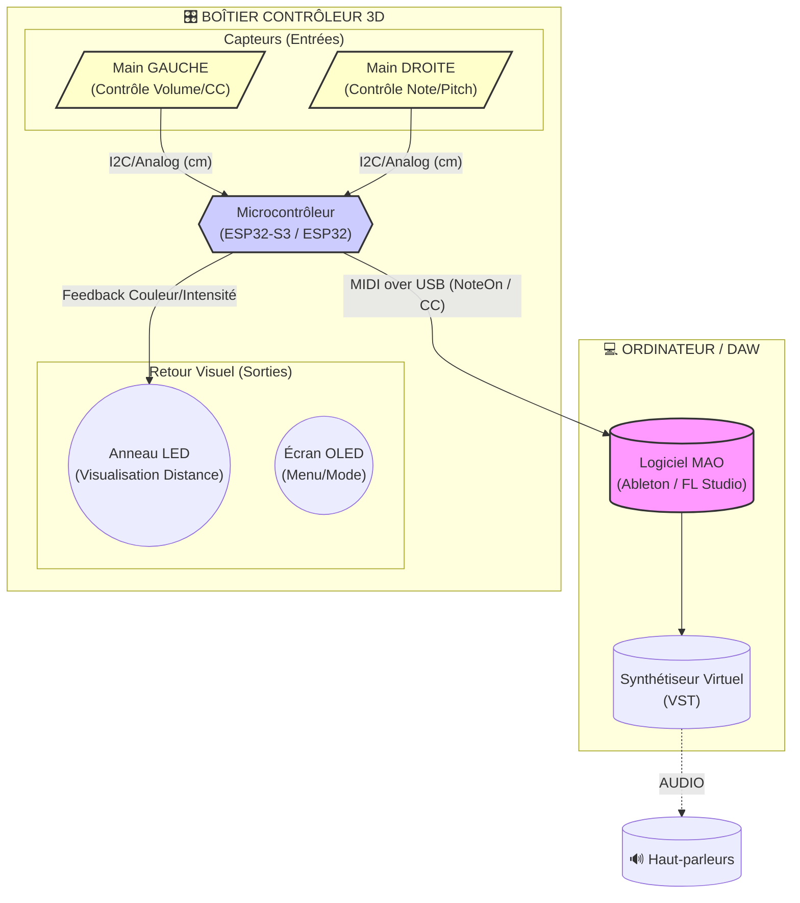
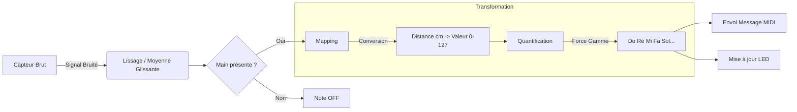

# AVIGNON UNIVERSITÉ | LICENCE PRO SN DOC
**La Salle Avignon – Frères des Écoles Chrétiennes**

---

# 🎵 FICHE PROJET 2026 : CONTRÔLEUR MUSICAL 3D SANS CONTACT

**Date :** 05 Décembre 2025
**Statut :** Lancement Officiel
**Niveau :** Expert (Traitement du signal + Temps réel)

## 1. Composition de l'Équipe
Ce projet est attribué au groupe de travail suivant :
* **Louis RAFFIN** 
* **Axelle LERENARD** 
* **Yann TOLOSANO**

---

## 2. Présentation générale du système

### Contexte
Depuis l'invention du Thérémine en 1920, la musique "sans contact" fascine. Aujourd'hui, avec l'essor de la M.A.O. (Musique Assistée par Ordinateur) et les besoins d'hygiène ou d'accessibilité (pour personnes à mobilité réduite), créer des interfaces de contrôle gestuel devient un enjeu technologique majeur.
Ce projet vise à créer un instrument ou une interface de contrôle musical invisible, piloté uniquement par la position des mains dans l'espace.

### Objectif du Projet
Créer une interface "AirMusic" capable de transformer des mouvements dans le vide en instructions musicales précises.
Le but ultime est l'implémentation du protocole **MIDI over USB** : l'appareil ne doit pas seulement émettre des sons simples, mais contrôler un véritable logiciel de production musicale professionnel (Ableton, GarageBand, FL Studio) comme un clavier maître standard.

### Innovation 2026 : Latence Zéro & Feedback
Le défi principal de ce projet est la **réactivité**. La latence entre le geste et le son doit être imperceptible (< 20ms).
L'innovation de cette année réside dans l'ajout d'un **retour visuel immédiat** (Anneau de LEDs ou Écran OLED) qui matérialise la note jouée, rendant l'instrument accessible aux non-musiciens.

---

## 3. Synoptique et Architecture Technique

### A. Architecture Matérielle (Hardware)
Le système transforme une grandeur physique (distance) en un protocole numérique musical (MIDI).

### B. Algorithme de Traitement du Signal
La conversion du signal brut des capteurs en note musicale stable nécessite un traitement algorithmique rigoureux pour éviter le "Jitter" (saut de notes).

---

## 4. Fonctionnalités & Cahier des Charges

### A. Détection Spatiale & Interprétation (Le Geste) 👋
Le cœur du projet réside dans la transformation d'une donnée brute de distance en intention musicale. L'équipe devra proposer une solution technique aux défis suivants :
* **Définition des Axes (X/Y) :** Comment répartir intelligemment les contrôles ? (Ex: Axe Vertical pour le Pitch, Axe Horizontal pour le Volume/Modulation).
* **Placement des Capteurs :** Une réflexion approfondie est attendue sur l'agencement physique pour éviter les zones mortes et les interférences entre capteurs (Crosstalk).
* **Polyphonie :** Le système se limite-t-il à une seule note à la fois (Monophonie) ? Les étudiants devront explorer des pistes pour permettre le jeu de plusieurs notes ou d'accords (Arpégiateur intelligent, mode "Latch", ou division de zone).

### B. Interface & Feedback Visuel
* **Anneau LED (NeoPixel) :** Doit changer de couleur (ex: du Bleu au Rouge) ou d'intensité en fonction de la distance de la main pour guider l'utilisateur.
* **Écran OLED (Optionnel) :** Affichage du mode actuel (Mode Piano, Mode Batterie, Mode DJ).

### C. Connectivité
* **MIDI over USB :** L'appareil doit être reconnu nativement ("Plug & Play") par Windows/MacOS comme un périphérique MIDI, sans installation de driver complexe.

---

## 5. Ressources & Inspiration (Bibliographie Technique)

L'équipe devra s'appuyer sur les références suivantes :
* **Référence historique :** *Le Thérémine* (Wikipédia) pour comprendre la logique de l'oscillateur contrôlé par le geste.
* **Tutoriels Techniques :**
    * *Arduino MIDI Controller (Notes and Volts)* : La ressource de référence pour le protocole MIDI.
    * *Adafruit VL53L5CX Guide* : Documentation pour les capteurs ToF matriciels (Multizone 8x8).
* **Composants Recommandés :**
    * Microcontrôleur : **ESP32-S3** (Recommandé pour l'USB Natif) ou **ESP32 Standard** (Pour MIDI via Bluetooth/WiFi).
    * Capteurs : **VL53L5CX** (ToF Matrice) pour une détection multi-zones précise, remplaçant le VL53L0X (cône trop large).

---

## 6. Jalons & Livrables Spécifiques 2026

| Date | Jalon | Livrable Technique Attendu |
| :--- | :--- | :--- |
| **10 Février** | **Jalon 1 (Spécifications)** | **POC MIDI.** Le système est capable d'envoyer une note simple à l'ordinateur via USB lorsqu'on passe la main devant un capteur (sur Breadboard). |
| **14 Avril** | **Jalon 2 (Mi-parcours)** | **Prototype Fonctionnel.** Les capteurs sont fixés. Le code gère le Pitch (Main Droite) et le Volume (Main Gauche) simultanément avec un début de lissage du signal. |
| **19 Juin** | **Soutenance Finale** | **Démonstration Musicale.** L'étudiant joue une mélodie reconnaissable ou contrôle un effet audio complexe en rythme sans latence audible. |

---

## 7. Critères d'Évaluation Spécifiques

1.  **Réactivité (Latence) :** Délai imperceptible entre le geste et le son.
2.  **Stabilité du Signal :** L'instrument ne doit pas jouer de fausses notes si la main ne bouge pas (filtrage du bruit électronique).
3.  **Ergonomie & Design :** Qualité du boîtier (Impression 3D ou Découpe Laser) et intégration esthétique des LEDs.
